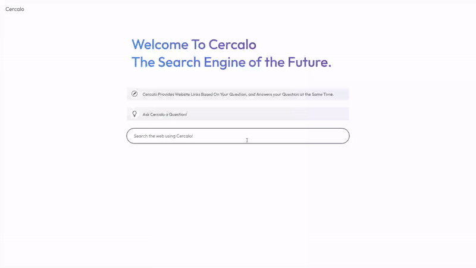

# Cercalo | React AI Answer Engine  

## Overview  
Cercalo is an AI-powered answer engine built using React. It enhances search functionality by leveraging the **Gemini API**, delivering contextually relevant answers while verifying results with websites. The project focuses on **speed, efficiency, and user-friendly interactions**.  

## Demo  
  


## Features  
- **AI-Powered Search**: Uses the Gemini API to provide accurate answers.  
- **Website Verification**: Ensures credibility by presenting websites to the user in which they can cross-reference sources.  
- **Dynamic UI**: Built with React for smooth and interactive user experiences.  
- **Optimized Performance**: Frontend and backend are designed for **fast** and **efficient** searches.  

## Tech Stack  
- **Frontend**: ReactJS, CSS
- **Backend**: Node.js, JSX, HTML
- **AI Integration**: Gemini API  

## Installation  

### Prerequisites  
- Node.js & npm installed  

### Steps  
1. Clone the repository:  
   ```sh
   git clone https://github.com/simranbadwal/Cercalo.git
   cd cercalo
   ```  
2. Install dependencies:  
   ```sh
   npm install
   ```  
3. Start the development server:  
   ```sh
   npm start
   ```  

## Usage  
- Enter a question in the search bar.  
- Cercalo fetches answers using **Gemini API** and cross-verifies sources.  
- Displays **relevant results** with an intuitive UI. 
